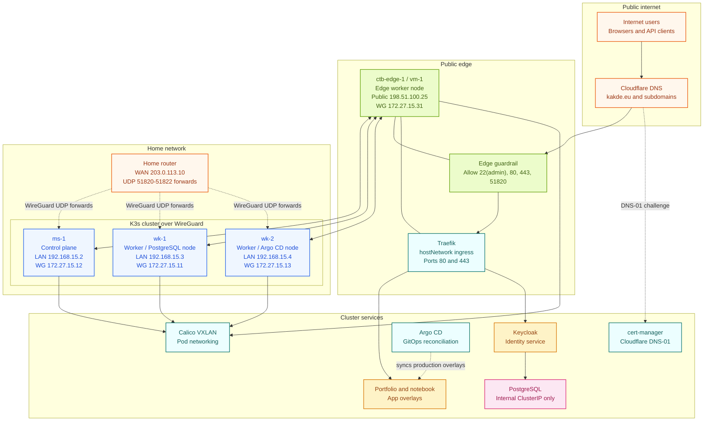

# Platform Architecture and Reference Layout

This document picks up where the introduction leaves off. It turns the high-level platform story into concrete architecture: node roles, network layout, platform versions, public hosts, and the design rules that guide the rest of the build.

## Architecture At A Glance

## How To Read This Architecture

- `ms-1` is the control-plane node. It is the main cluster administration machine.
- `wk-1` is the database worker. PostgreSQL is intentionally kept away from the public edge.
- `wk-2` is the GitOps worker. Argo CD is pinned there to keep its placement predictable.
- `ctb-edge-1` is the public edge node. In local SSH usage, this same machine is reached as `vm-1`.
- WireGuard connects every node over a stable private mesh, and K3s uses those WireGuard IPs as node addresses.
- Traefik is the only intended public web entry point.
- cert-manager handles certificate issuance through Cloudflare DNS validation, so you do not need extra public challenge ports.
- PostgreSQL and most cluster services remain private inside Kubernetes.

## Current Reference Layout

### Nodes

| Node | Role | Location | LAN IP | WireGuard IP | Notes |
| --- | --- | --- | --- | --- | --- |
| `ms-1` | control plane | home | `192.168.15.2` | `172.27.15.12` | K3s server and main admin host |
| `wk-1` | worker | home | `192.168.15.3` | `172.27.15.11` | PostgreSQL node |
| `wk-2` | worker | home | `192.168.15.4` | `172.27.15.13` | Argo CD node |
| `ctb-edge-1` | edge worker | cloud | n/a | `172.27.15.31` | public ingress node, SSH alias `vm-1` |

### Network Settings

- home LAN: `192.168.15.0/24`
- WireGuard network: `172.27.15.0/24`
- WireGuard MTU: `1420`
- pod CIDR: `10.42.0.0/16`
- service CIDR: `10.43.0.0/16`

### Platform Versions

- K3s: `v1.35.1+k3s1`
- Calico: `v3.31.4`
- Traefik: `v2.11`
- cert-manager: `v1.19.1`
- Argo CD: `v3.3.3`
- PostgreSQL: `17.9`
- Keycloak: `26.5.5`

### Public Hosts

- `kakde.eu`
- `dev.kakde.eu`
- `notebook.kakde.eu`
- `argocd.kakde.eu`
- `keycloak.kakde.eu`
- `whoami.kakde.eu`
- `whoami-auth.kakde.eu`

## Core Design Rules

### 1. Private network first

WireGuard comes first. If the mesh is not healthy, do not install or troubleshoot Kubernetes yet.

### 2. One public entry point

Only the edge node should receive public web traffic. Home nodes should not become accidental ingress nodes.

### 3. Keep K3s minimal

K3s is installed with flannel, built-in network policy, built-in Traefik, and ServiceLB disabled. That keeps networking and ingress under explicit control.

### 4. Give important services clear homes

PostgreSQL runs on `wk-1`. Argo CD runs on `wk-2`. Traefik runs on the edge node. This makes placement easier to explain, observe, and recover.

### 5. Keep internal services internal

PostgreSQL is reachable through internal Kubernetes networking only. It is not published to the internet.

### 6. Prefer repeatable steps over clever fixes

If something drifts, the right answer is to improve the documented rebuild path, not to rely on undocumented one-off commands.

## Next Step

Continue with [02. Rebuild Cluster Step by Step](02-rebuild-cluster-step-by-step.md). That guide takes you from clean machines to a healthy base cluster.
