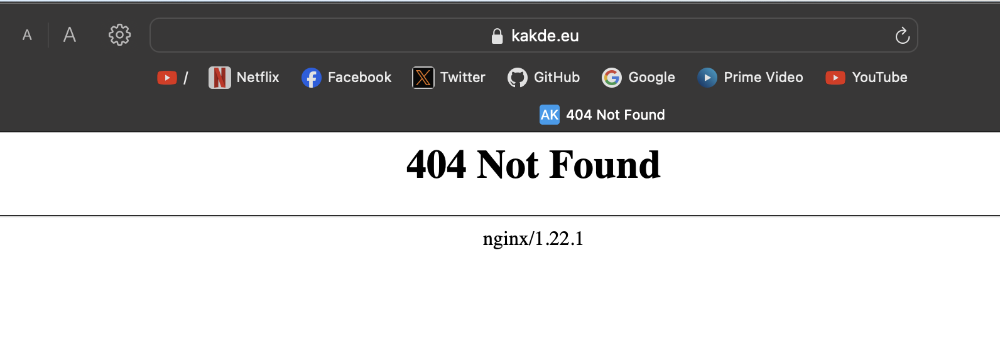

Login as Root
`sudo su -`

Update:
`apt update`

Set hostname
`hostnamectl set-hostname gw-vpn-server`

Edit the /etc/hosts

```bash
127.0.0.1       localhost

# The following lines are desirable for IPv6 capable hosts
::1     localhost ip6-localhost ip6-loopback
ff02::1 ip6-allnodes
ff02::2 ip6-allrouters

185.230.138.134 gw-vpn-server gw-vpn-server.kakde.eu
```

Now logout and login again:
```bash
root@gw-vpn-server:~#
```

Install certbot:
Certbot - Let’s us fetch SSL certificates from Let’s Encrypt python3-certbot-nginx - Helps us configure Nginx SSL config.
`apt install certbot python3-certbot-nginx`

Create letsencrypt.conf:
`nano /etc/nginx/snippets/letsencrypt.conf` with content:

```text
location ^~ /.well-known/acme-challenge/ {
    default_type "text/plain";
    root /var/www/letsencrypt;
}
```

Create the directory with command : `mkdir /var/www/letsencrypt`

Step 3 - Configure Nginx for HTTP

Create file `/etc/nginx/sites-enabled/kakde.eu` (Change the domain name accordingly ;)

```text
server {
    listen 80;

    include /etc/nginx/snippets/letsencrypt.conf;

    server_name kakde.eu www.kakde.eu;

    root /var/www/kakde.eu;
    index index.html;
}
```

Verify nginx 
`nginx -t` =>

```output
root@gw-vpn-server:~# nginx -t
nginx: the configuration file /etc/nginx/nginx.conf syntax is ok
nginx: configuration file /etc/nginx/nginx.conf test is successful
```

Reload Nginx

`systemctl reload nginx`

<hr>

### Fetch the Certificate

For the site `kakde.eu` and `www.kakde.eu`

First create a file at : /etc/nginx/sites-enabled/kakde.eu with command: `nano /etc/nginx/sites-enabled/kakde.eu`

with content:

```text
server {
    listen 80;

    include /etc/nginx/snippets/letsencrypt.conf;

    server_name kakde.eu www.kakde.eu;

    root /var/www/kakde.eu;
    index index.html;
}
```

then fetch certificate with command: `certbot --nginx -d kakde.eu -d www.kakde.eu`

```text
root@gw-vpn-server:~# certbot --nginx -d kakde.eu -d www.kakde.eu
Saving debug log to /var/log/letsencrypt/letsencrypt.log
Requesting a certificate for kakde.eu and www.kakde.eu

Successfully received certificate.
Certificate is saved at: /etc/letsencrypt/live/kakde.eu/fullchain.pem
Key is saved at:         /etc/letsencrypt/live/kakde.eu/privkey.pem
This certificate expires on 2024-11-06.
These files will be updated when the certificate renews.
Certbot has set up a scheduled task to automatically renew this certificate in the background.

Deploying certificate
Successfully deployed certificate for kakde.eu to /etc/nginx/sites-enabled/kakde.eu
Successfully deployed certificate for www.kakde.eu to /etc/nginx/sites-enabled/kakde.eu
Congratulations! You have successfully enabled HTTPS on https://kakde.eu and https://www.kakde.eu

- - - - - - - - - - - - - - - - - - - - - - - - - - - - - - - - - - - - - - - -
If you like Certbot, please consider supporting our work by:
 * Donating to ISRG / Let's Encrypt:   https://letsencrypt.org/donate
 * Donating to EFF:                    https://eff.org/donate-le
- - - - - - - - - - - - - - - - - - - - - - - - - - - - - - - - - - - - - - - -
root@gw-vpn-server:~#
```

then after successful certificate fetch you should see the modified content of `/etc/nginx/sites-enabled/kakde.eu`, with command: `cat /etc/nginx/sites-enabled/kakde.eu`

```text
server {

    include /etc/nginx/snippets/letsencrypt.conf;

    server_name kakde.eu www.kakde.eu;

    root /var/www/kakde.eu;
    index index.html;

    listen 443 ssl; # managed by Certbot
    ssl_certificate /etc/letsencrypt/live/kakde.eu/fullchain.pem; # managed by Certbot
    ssl_certificate_key /etc/letsencrypt/live/kakde.eu/privkey.pem; # managed by Certbot
    include /etc/letsencrypt/options-ssl-nginx.conf; # managed by Certbot
    ssl_dhparam /etc/letsencrypt/ssl-dhparams.pem; # managed by Certbot
}
server {
    if ($host = www.kakde.eu) {
        return 301 https://$host$request_uri;
    } # managed by Certbot


    if ($host = kakde.eu) {
        return 301 https://$host$request_uri;
    } # managed by Certbot


    listen 80;

    server_name kakde.eu www.kakde.eu;
    return 404; # managed by Certbot

}
```

then you will see the default output:



<hr>

#### Enable auto renew

Let’s Encrypt certificates expire in 90 days. So we need to make sure that we renew them much before. Renewal is done by using the command certbot renew.

Add it as a cron so that it runs every 30 days or so.

With command `crontab -e` to edit the crontab. If you are non-root user, do `sudo crontab -e` Add the following lines

30 2 * * 1 /usr/bin/certbot renew >> /var/log/certbot_renew.log 2>&1
35 2 * * 1 /etc/init.d/nginx reload

The first one renews the certificate and the second one reloads nginx These runs once a month at 2.30AM and 2.35AM respectively

<hr>

### Redirecting www -> non-www and http -> https (HTTP request)

It is recommended that you enable HTTP to HTTPS redirection Edit the nginx conf and make it look like this
`nano /etc/nginx/sites-enabled/kakde.eu`

```text
# For redirecting www -> non-www and http -> https (HTTP request)
server {
    listen 80;

    include /etc/nginx/snippets/letsencrypt.conf;

    server_name kakde.eu www.kakde.eu;

    # Redirect http -> https
    # Also Redirect www -> non www
    location / {
        return 301 https://kakde.eu$request_uri;
    }
}

# For redirecting www -> non-www (HTTPS request)
server {
    listen 443 ssl; # managed by Certbot

    ssl_certificate /etc/letsencrypt/live/kakde.eu/fullchain.pem; # managed by Certbot
    ssl_certificate_key /etc/letsencrypt/live/kakde.eu/privkey.pem; # managed by Certbot
    include /etc/letsencrypt/options-ssl-nginx.conf; # managed by Certbot
    ssl_dhparam /etc/letsencrypt/ssl-dhparams.pem; # managed by Certbot

    server_name www.kakde.eu;

    # Redirect www -> non www
    location / {
        return 301 https://kakde.eu$request_uri;
    }
}

# For serving the non-www site (HTTPS) with worker-01 via wireguard tunnel
upstream backend {
    server 10.0.1.2:30000;  # worker-01
}

server {
    listen 443 ssl; # managed by Certbot

    ssl_certificate /etc/letsencrypt/live/kakde.eu/fullchain.pem; # managed by Certbot
    ssl_certificate_key /etc/letsencrypt/live/kakde.eu/privkey.pem; # managed by Certbot
    include /etc/letsencrypt/options-ssl-nginx.conf; # managed by Certbot
    ssl_dhparam /etc/letsencrypt/ssl-dhparams.pem; # managed by Certbot

    server_name kakde.eu;

    # Proxy to Kubernetes NodePort Service via WireGuard
    location / {
        proxy_pass http://backend;
        proxy_set_header Host $host;
        proxy_set_header X-Real-IP $remote_addr;
        proxy_set_header X-Forwarded-For $proxy_add_x_forwarded_for;
        proxy_set_header X-Forwarded-Proto $scheme;
    }
}
```


